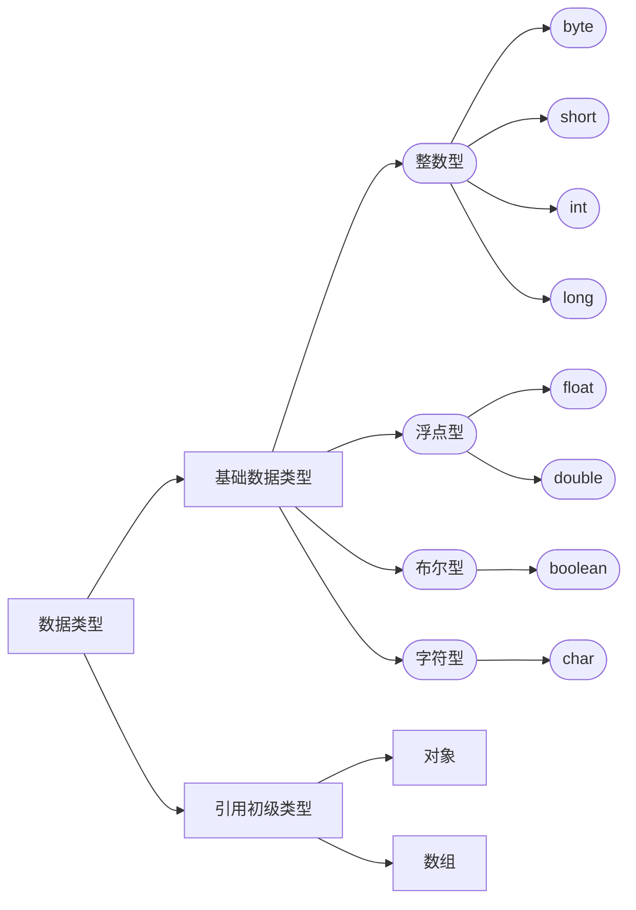

在JAVA中有2种数据类型
1. 基本数据类型
2. 引用数据类型

#### 基本数据类型
引用数据类型包括byte,char,short,int,long,float,double,boolean。看下图

* byte 8位内存空间(-128 - 127)
* short 16位内存空间(-32768 - 32767)
* int 32位内存空间(-2147483648 - 2147483647)
* long 64位内存空间(-9223372036854775808 - 9223372036854775807)
* float 32位(1.4E-45 - 3.4028235E38)
* double 64(4.9E-324 - 1.7976931348623157E308)
* char 16位 Unicode 字符(\u0000-\uffff)
* boolean 16

#### 引用数据类型
对象、数组都是引用数据类型。引用类型默认值都是null

#### 数据类型转换

##### 隐示转换

##### 显示转换
